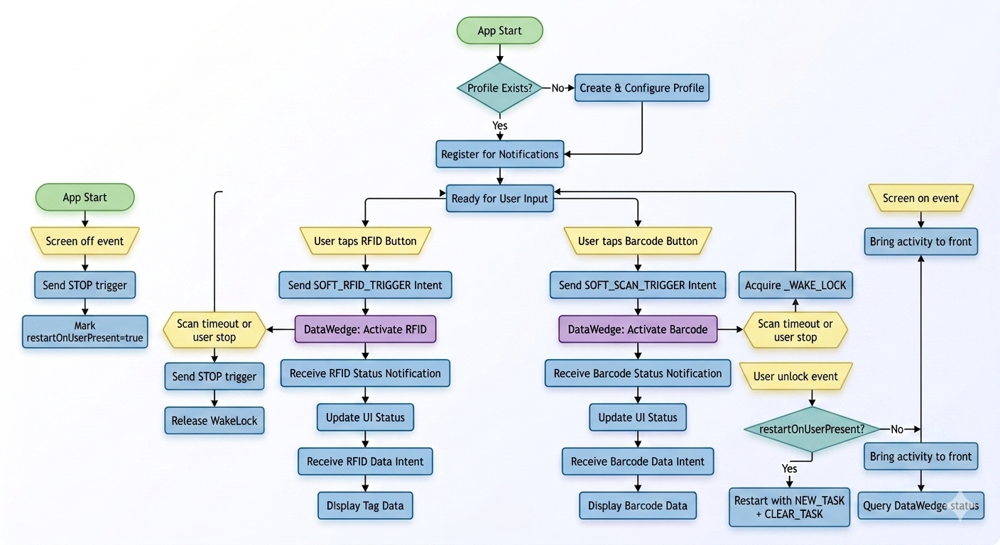

# Design: RFID & Barcode Operations

## Overview
This document details the architecture and flow of RFID and Barcode operations in the DataWedgeApp RfidECRT_RWDemo2 project.
For onboarding and exact DataWedge profile values, see the DataWedge Profile Requirements section in [README.md](README.md#datawedge-profile-requirements).

## Tested Platforms
- EM45
- TC53e-RFID
- TC27-RFD40P

## DataWedge/Firmware Compatibility Matrix

| Device | DataWedge/Firmware | OS Build | Validation Date |
| --- | --- | --- | --- |
| EM45 | NA | Not recorded | May 2026 |
| TC53e-RFID | NA | Not recorded | May 2026 |
| TC27-RFD40P | 15.0.77 / 11R01 | AT_FULL_UPDATE_14-35-10.00-UG-U127-STD-ATH-04 | May 2026 |

## Release 1.0.2 Highlights
- On `ACTION_SCREEN_OFF`, the activity is moved to background with `moveTaskToBack(true)` after active scans are stopped.
- Added explicit suspend transition logging for easier troubleshooting.
- Updated user-facing app/version strings to `Rfid DW Demo v1.0.2`.
- Refreshed legal/about copy to 2026 where applicable.
- Modernized EPC result presentation with per-tag card rows (index, EPC value, and count badge).
- Introduced count-threshold badge styling for quick high-volume tag detection.
- Hidden top Unique/Total summary bar in favor of row-level count clarity.
- Added release automation helpers for deployment and device suspend/resume.

## Key Components
- **RWDemoActivity**: Main UI and logic controller for RFID/Barcode operations.
- **RWDemoIntentParams**: Centralized intent and parameter definitions for DataWedge API.

## Architecture Summary

The app is organized around three layers:

| Layer | Responsibility | Primary code |
| --- | --- | --- |
| Profile setup | Build and submit DataWedge `SET_CONFIG` for the `RWDemo` profile | [RWDemoActivity.java](app/src/main/java/com/zebra/rfid/rwdemo2/RWDemoActivity.java), [RWDemoIntentParams.java](app/src/main/java/com/zebra/rfid/rwdemo2/RWDemoIntentParams.java) |
| Runtime control | Start/stop RFID and barcode reads with soft triggers and notifications | [RWDemoActivity.java](app/src/main/java/com/zebra/rfid/rwdemo2/RWDemoActivity.java), [DataWedgeHelper.java](app/src/main/java/com/zebra/rfid/rwdemo2/DataWedgeHelper.java) |
| Result rendering | Turn decoded payloads into EPC cards and per-tag counts | [RWDemoActivity.java](app/src/main/java/com/zebra/rfid/rwdemo2/RWDemoActivity.java), [item_tag_count_row.xml](app/src/main/res/layout/item_tag_count_row.xml) |

## DataWedge Intent API Primer

This app uses DataWedge as the hardware and configuration bridge. The app does not talk to RFID or scanner hardware directly; it sends DataWedge intents and listens for DataWedge results and notifications.

### Core intent actions used by the app

- `com.symbol.datawedge.api.ACTION`: Main command channel for DataWedge.
- `com.symbol.datawedge.api.SET_CONFIG`: Creates or updates the `RWDemo` profile.
- `com.symbol.datawedge.api.GET_PROFILES_LIST`: Checks whether the profile exists.
- `com.symbol.datawedge.api.GET_ACTIVE_PROFILE`: Confirms profile activation.
- `com.symbol.datawedge.api.REGISTER_FOR_NOTIFICATION`: Subscribes to scanner/RFID status changes.
- `com.symbol.datawedge.api.GET_SCANNER_STATUS`: Queries scanner state.
- `com.symbol.datawedge.api.GET_RFID_STATUS`: Queries RFID state.

### Data delivered back to the app

- `com.symbol.datawedge.api.RESULT_ACTION`: Result broadcasts from DataWedge.
- `com.symbol.datawedge.api.NOTIFICATION_ACTION`: Notification broadcasts from DataWedge.
- `com.symbol.datawedge.data_string`: Decoded barcode or RFID payload.
- `com.symbol.datawedge.source`: Source of the decoded data, such as `scanner` or `rfid`.

## Intent Flow Overview

The app follows this sequence:

1. Create or verify the `RWDemo` profile.
2. Register for scanner and RFID status notifications.
3. Send soft-trigger intents to start/stop RFID or barcode reads.
4. Receive decoded data in `onNewIntent()`.
5. Update the modern EPC card list UI with unique tags and counts.

## Code Snippets

### 1. Centralized DataWedge constants

The app keeps DataWedge strings in one place so the configuration and runtime code use the same values.

```java
public static final String ACTION = "com.symbol.datawedge.api.ACTION";
public static final String ACTION_EXTRA_SET_CONFIG = "com.symbol.datawedge.api.SET_CONFIG";
public static final String GET_AVAILABLE_PROFILE_LIST = "com.symbol.datawedge.api.GET_PROFILES_LIST";
public static final String GET_ACTIVE_PROFILE = "com.symbol.datawedge.api.GET_ACTIVE_PROFILE";

public static final String BUNDLE_EXTRA_PROFILE_NAME_VAL = "RWDemo";
public static final String INTENT_ACTION_VALUE = "com.zebra.rfid.rwdemo.RWDEMO2";
public static final String INTENT_CATEGORY_VALUE = "android.intent.category.DEFAULT";
```

Why this matters:
- It keeps the runtime code, documentation, and DataWedge profile values aligned.
- It reduces mistakes from hard-coded strings scattered across the app.

### 2. Sending a profile configuration to DataWedge

`createProfile()` builds a `SET_CONFIG` bundle with RFID, barcode, intent, and keystroke plugins.

```java
Bundle setConfigBundle = new Bundle();
setConfigBundle.putString(RWDemoIntentParams.BUNDLE_EXTRA_PROFILE_NAME_KEY, RWDemoIntentParams.BUNDLE_EXTRA_PROFILE_NAME_VAL);
setConfigBundle.putString(RWDemoIntentParams.BUNDLE_EXTRA_CONFIG_MODE_KEY, RWDemoIntentParams.BUNDLE_EXTRA_CONFIG_MODE_VAL);
setConfigBundle.putString(RWDemoIntentParams.BUNDLE_EXTRA_PROFILE_ENABLED_KEY, RWDemoIntentParams.BUNDLE_EXTRA_PROFILE_ENABLED_VAL);

Intent intent = new Intent();
intent.setAction(RWDemoIntentParams.ACTION);
intent.putExtra(RWDemoIntentParams.ACTION_EXTRA_SET_CONFIG, setConfigBundle);
intent.putExtra(EXTRA_SEND_RESULT, "true");
intent.putExtra(EXTRA_COMMAND_IDENTIFIER, "RFID_CONFIG");
sendBroadcast(intent);
```

How to use this pattern:
- Use `ACTION` as the command channel.
- Put `SET_CONFIG` in the extras bundle.
- Set `SEND_RESULT=true` when you need DataWedge to report success/failure.
- Use a stable `COMMAND_IDENTIFIER` so the result can be matched later.

### 3. Triggering RFID or barcode scanning

`RWDemoActivity` wraps soft triggers so UI code only decides whether to start or stop.

```java
private void triggerHardware(String triggerExtra, String command) {
    Intent i = new Intent();
    i.setAction(RWDemoIntentParams.ACTION);
    i.putExtra(triggerExtra, command);
    sendBroadcast(i);
}
```

RFID start/stop example:

```java
private void startRfidScan() {
    if (rfidScanState) return;
    rfidScanState = true;
    showProgressDialog("Reading RFID... (Timeout in 5s)");
    updateStatusUI(rfidStatusText, R.string.status_rfid, STATUS_SCANNING);
    triggerHardware(ACTION_EXTRA_SOFT_RFID_TRIGGER, TRIGGER_START);
    timeoutHandler.postDelayed(rfidTimeoutRunnable, SCAN_TIMEOUT_MS);
}
```

Barcode start example:

```java
private void startBarcodeScan() {
    if (barcodeScanState) return;
    barcodeScanState = true;
    showProgressDialog("Reading Barcode... (Timeout in 5s)");
    triggerHardware(ACTION_EXTRA_SOFT_SCAN_TRIGGER, TRIGGER_START);
    timeoutHandler.postDelayed(barcodeTimeoutRunnable, SCAN_TIMEOUT_MS);
}
```

### 4. Using the helper for cleaner intent calls

`DataWedgeHelper` is a convenience wrapper around the same intent patterns.

```java
public void sendSoftRfidTrigger(boolean start) {
    Bundle extras = new Bundle();
    extras.putString(RWDemoIntentParams.ACTION_EXTRA_SOFT_RFID_TRIGGER, start ? "START_SCANNING" : "STOP_SCANNING");
    sendDataWedgeIntent(RWDemoIntentParams.ACTION, extras);
}
```

Use this pattern when:
- You want to keep Activity code small and readable.
- You need a single place to handle `sendBroadcast()` failures.

### 5. Receiving decoded data from DataWedge

The app consumes decoded RFID/barcode results in `onNewIntent()` and `handleDecodeData()`.

```java
@Override
public void onNewIntent(Intent i) {
    onNewIntentToOnResume = true;
    handleDecodeData(i);
}
```

```java
private void handleDecodeData(Intent i) {
    if (i == null) return;

    DataWedgeSupport.DecodedData decodedData = DataWedgeSupport.decode(i);
    String data = decodedData.data;
    String source = decodedData.source;

    if (data != null && data.length() > 0) {
        totalTags++;
        uniqueTags.add(data);
        int tagCount = tagCounts.containsKey(data) ? tagCounts.get(data) + 1 : 1;
        tagCounts.put(data, tagCount);
        renderTagRows();
    }
}
```

How to use this pattern:
- Use `DataWedgeSupport.decode()` to normalize payload, source, and label type extraction.
- Use decoded `source` to distinguish scanner vs RFID.
- Update your UI state only after a non-empty payload arrives.

### 6. Registering for status notifications

The app registers for scanner and RFID notifications so the UI can show live state.

```java
private void registerForNotifications() {
    Bundle b = new Bundle();
    b.putString(BUNDLE_EXTRA_APPLICATION_NAME, getPackageName());
    b.putString(BUNDLE_EXTRA_NOTIFICATION_TYPE, NOTIFICATION_TYPE_SCANNER_STATUS);
    Intent i = new Intent();
    i.setAction(ACTION);
    i.putExtra(ACTION_EXTRA_REGISTER_FOR_NOTIFICATION, b);
    sendBroadcast(i);
}
```

Use this pattern when:
- You want the UI to reflect `WAITING`, `SCANNING`, `CONNECTED`, or `DISCONNECTED` states.
- You need to stop a progress indicator as soon as DataWedge reports idle/waiting.

## Operation Flows

### 1. App Startup & Profile Configuration
- On launch, the app checks for the DataWedge profile "RWDemo".
- If not present, it creates and configures the profile with required plugins (RFID, Barcode, Intent, Keystroke).
- Registers for DataWedge notifications (RFID/Scanner status).

### 2. RFID Operation Flow
- User taps the RFID trigger button.
- App sends SOFT_RFID_TRIGGER intent to DataWedge.
- DataWedge activates RFID hardware and returns status via notification.
- App updates UI status bar (color and text) based on notification.
- Tag data is received via intent and displayed in the output view.

### 3. Barcode Operation Flow
- User taps the Barcode trigger button.
- App sends SOFT_SCAN_TRIGGER intent to DataWedge.
- DataWedge activates Barcode hardware and returns status via notification.
- App updates UI status bar (color and text) based on notification.
- Barcode data is received via intent and displayed in the output view.

### 4. Suspend/Background and Resume/Restart Flow

This project already handles screen suspend/resume events in `SystemStateReceiver`.
On suspend, active scans are stopped and the app marks a restart request. On wake/unlock, the activity is brought to front and may be restarted.

Current pattern in `RWDemoActivity`:

```java
private class SystemStateReceiver extends BroadcastReceiver {
    @Override
    public void onReceive(Context context, Intent intent) {
        String action = intent.getAction();
        if (action == null) return;

        switch (action) {
            case Intent.ACTION_SCREEN_OFF:
                stopRfidScan();
                stopBarcodeScan();
                restartOnUserPresent = true;
                moveTaskToBack(true);
                Log.d(TAG, "ECRT OS Event: moveTaskToBack!!!");
                break;

            case Intent.ACTION_USER_PRESENT:
                if (restartOnUserPresent) {
                    restartOnUserPresent = false;
                    Intent i = new Intent(RWDemoActivity.this, RWDemoActivity.class);
                    i.addFlags(Intent.FLAG_ACTIVITY_NEW_TASK | Intent.FLAG_ACTIVITY_CLEAR_TASK);
                    startActivity(i);
                    finishAffinity();
                } else {
                    Intent i = new Intent(RWDemoActivity.this, RWDemoActivity.class);
                    i.addFlags(Intent.FLAG_ACTIVITY_REORDER_TO_FRONT
                            | Intent.FLAG_ACTIVITY_SINGLE_TOP
                            | Intent.FLAG_ACTIVITY_NEW_TASK);
                    startActivity(i);
                }
                queryStatus();
                break;
        }
    }
}
```

Use this when:
- You want to stop hardware reads immediately on suspend.
- You want to preserve task state and quickly return to the same activity instance.

Current runtime behavior summary:
- `ACTION_SCREEN_OFF`: stop active reads, set `restartOnUserPresent=true`, and move task to background.
- `ACTION_USER_PRESENT`: if flagged, perform full task restart using `NEW_TASK|CLEAR_TASK`; otherwise reorder-to-front.

### 5. WakeLock Behavior During Scanning

The app uses a `PARTIAL_WAKE_LOCK` named `RWDemo:ScanWakeLock` to keep CPU work alive while a scan is active, even if the screen state changes.

Initialization in `onCreate()`:

```java
PowerManager pm = (PowerManager) getSystemService(Context.POWER_SERVICE);
if (pm != null) {
    wakeLock = pm.newWakeLock(PowerManager.PARTIAL_WAKE_LOCK, "RWDemo:ScanWakeLock");
}
```

Acquire on scan start (RFID and barcode):

```java
if (wakeLock != null && !wakeLock.isHeld()) {
    wakeLock.acquire(SCAN_TIMEOUT_MS + 2000);
}
```

Release on scan stop in `finally` blocks:

```java
finally {
    if (wakeLock != null && wakeLock.isHeld()) {
        wakeLock.release();
    }
}
```

How this works end-to-end:
- WakeLock is held only while a scan is in progress.
- Scan timeout (`SCAN_TIMEOUT_MS`) stops scan and releases WakeLock automatically.
- Manual stop paths also release WakeLock.
- The `+2000ms` safety window allows cleanup/stop commands to finish before auto-release.

Suspend/resume test command examples:

```bash
./suspend_resume_device.sh suspend
./suspend_resume_device.sh resume
```

Expected behavior checklist:
- Suspend: active scans stop and WakeLock is released.
- Resume + unlock: app restarts if `restartOnUserPresent` is set; otherwise it is brought to front.
- DataWedge notifications are re-registered by normal activity lifecycle (`onResume`).

## Practical Usage Notes

- Keep `RWDemoIntentParams` as the source of truth for every DataWedge string.
- Prefer helper methods like `sendSoftRfidTrigger()` and `sendProfileConfig()` over building intents inline in multiple places.
- Use `SEND_RESULT=true` for profile/config commands so you can detect failures early.
- Always handle null or missing `source` and `data_string` extras defensively.
- Match DataWedge output action `com.zebra.rfid.rwdemo.RWDEMO2` to the manifest intent filter, or decoded data will not reach the app.

## Code Review Notes

- The current implementation correctly centralizes DataWedge constants and profile setup, which keeps the app consistent across onboarding, runtime configuration, and documentation.
- The soft-trigger and notification flow is functionally correct, but the main activity still carries significant lifecycle and UI complexity; future cleanup should focus on extracting receiver/status logic into smaller units.
- The modern EPC card UI is a strong improvement for readability, but it depends on dynamic row rendering, so the view container should remain lightweight and responsive.

## Flowchart

The Mermaid diagram below is the source of truth for lifecycle, WakeLock, and scan timeout behavior.



## Code Review Snapshot (May 2026)
- Verified profile configuration constants in code match README DataWedge requirements (profile name, plugins, and intent output values).
- Verified startup flow attempts automatic profile creation with CREATE_IF_NOT_EXIST and registers for RFID/scanner notifications.
- Verified both soft-trigger paths (RFID and barcode) use DataWedge intent APIs and update status/data through broadcast handling.

## Suggestions
- Automated tests now cover intent construction, decode parsing, key status-handling branches, and an activity-level broadcast receiver path.
- Relaunch and restart are gated under `ACTION_USER_PRESENT` to avoid resume-side relaunch before unlock.
