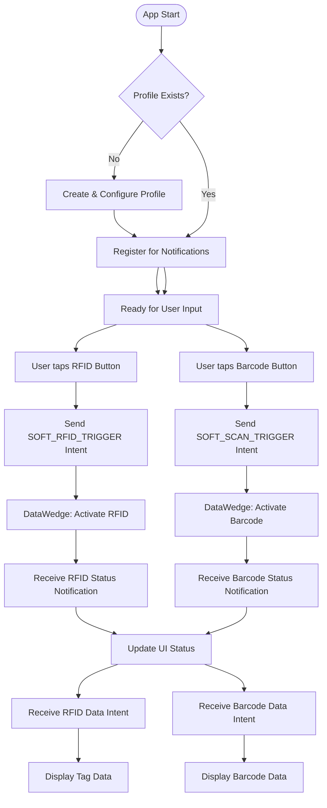

# Design: RFID & Barcode Operations

## Overview
This document details the architecture and flow of RFID and Barcode operations in the DataWedgeApp RfidECRT_RWDemo2 project.
For onboarding and exact DataWedge profile values, see the DataWedge Profile Requirements section in [README.md](README.md#datawedge-profile-requirements).

## Tested Platforms
- EM45
- TC53e-RFID
- TC27-RFD40P

## DataWedge/Firmware Compatibility Matrix

| Device | DataWedge/Firmware | OS Build | Validation Date |
| --- | --- | --- | --- |
| EM45 | NA | Not recorded | May 2026 |
| TC53e-RFID | NA | Not recorded | May 2026 |
| TC27-RFD40P | 15.0.77 / 11R01 | AT_FULL_UPDATE_14-35-10.00-UG-U127-STD-ATH-04 | May 2026 |

## Release 1.0.0 Highlights
- Modernized EPC result presentation with per-tag card rows (index, EPC value, and count badge).
- Introduced count-threshold badge styling for quick high-volume tag detection.
- Hidden top Unique/Total summary bar in favor of row-level count clarity.
- Added release automation helpers for deployment and device suspend/resume.

## Key Components
- **RWDemoActivity**: Main UI and logic controller for RFID/Barcode operations.
- **RWDemoIntentParams**: Centralized intent and parameter definitions for DataWedge API.

## Operation Flows

### 1. App Startup & Profile Configuration
- On launch, the app checks for the DataWedge profile "RWDemo".
- If not present, it creates and configures the profile with required plugins (RFID, Barcode, Intent, Keystroke).
- Registers for DataWedge notifications (RFID/Scanner status).

### 2. RFID Operation Flow
- User taps the RFID trigger button.
- App sends SOFT_RFID_TRIGGER intent to DataWedge.
- DataWedge activates RFID hardware and returns status via notification.
- App updates UI status bar (color and text) based on notification.
- Tag data is received via intent and displayed in the output view.

### 3. Barcode Operation Flow
- User taps the Barcode trigger button.
- App sends SOFT_SCAN_TRIGGER intent to DataWedge.
- DataWedge activates Barcode hardware and returns status via notification.
- App updates UI status bar (color and text) based on notification.
- Barcode data is received via intent and displayed in the output view.

## Flowchart

## Code Review Snapshot (May 2026)
- Verified profile configuration constants in code match README DataWedge requirements (profile name, plugins, and intent output values).
- Verified startup flow attempts automatic profile creation with CREATE_IF_NOT_EXIST and registers for RFID/scanner notifications.
- Verified both soft-trigger paths (RFID and barcode) use DataWedge intent APIs and update status/data through broadcast handling.

## Suggestions
- Add automated tests for intent construction/parsing and status-handling branches.
