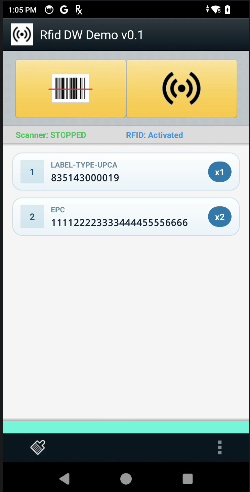

## DataWedge Profile Requirements

This app depends on a DataWedge profile named **RWDemo**.

At startup, the app sends `SET_CONFIG` with `CREATE_IF_NOT_EXIST` and attempts to configure the profile automatically. If auto-configuration fails (for example, due to device policy, missing plugin support, or DataWedge state), configure the profile manually using the required values below.


### Required Profile Values

- **Profile name**: `RWDemo`
- **Config mode**: `CREATE_IF_NOT_EXIST`
- **Profile enabled**: `true`
- **Associated app**: package `com.zebra.rfid.rwdemo2`, activity list `*`

### Required Plugin Configuration

- **RFID plugin (`RFID`)**: `rfid_input_enabled=true`
- **RFID formatting plugin (`RFID_F`)**: output plugin name `INTENT`
- **Barcode plugin (`BARCODE`)**: `scanner_input_enabled=true`
- **Intent output plugin (`INTENT`)**:
    - `intent_output_enabled=true`
    - `intent_action=com.zebra.rfid.rwdemo.RWDEMO2`
    - `intent_category=android.intent.category.DEFAULT`
    - `intent_delivery=0`
- **Keystroke output plugin (`KEYSTROKE`)**: `keystroke_output_enabled=false`

### Manual Setup Steps (DataWedge UI)

1. Open **DataWedge** on the device.
2. Create or edit profile **RWDemo**.
3. Associate the profile with app package **com.zebra.rfid.rwdemo2** and activity `*`.
4. Enable plugins and set values exactly as listed in **Required Plugin Configuration**.
5. Save the profile and relaunch the app.

### Quick Verification Checklist

- DataWedge is installed and enabled on the target device.
- Profile **RWDemo** exists and is active for this app.
- Triggering RFID/Barcode updates status indicators in-app.
- Decoded data is delivered to action `com.zebra.rfid.rwdemo.RWDEMO2`.

If profile creation or activation still fails, check device support for RFID and scanner plugins and confirm DataWedge is not restricted by device management policy.
# DataWedge RFID/Barcode Demo App (ECRT)



## Tested Platforms

- EM45
- TC53e-RFID
- TC27-RFD40P

## DataWedge/Firmware Compatibility Matrix

| Device | DataWedge/Firmware | OS Build | Validation Date |
| --- | --- | --- | --- |
| EM45 | NA | Not recorded | May 2026 |
| TC53e-RFID | NA | Not recorded | May 2026 |
| TC27-RFD40P | 15.0.77 / 11R01 | AT_FULL_UPDATE_14-35-10.00-UG-U127-STD-ATH-04 | May 2026 |

## Directory Structure

### Local Project Structure

```
DataWedgeApp/RfidECRT_RWDemo2/
├── app/
│   ├── src/main/java/com/zebra/rfid/rwdemo2/  # Main source code (RWDemoActivity, RWDemoIntentParams, etc.)
│   ├── res/                                   # Resources (layouts, strings, etc.)
│   └── ...
├── build_deploy_launch.sh                     # Build & deploy script
├── README.md
├── DESIGN.md                                  # Design and flow documentation
└── ...
```

### Remote Repository

GitHub: https://github.com/GelatoCookie/zebra.rfid.rwdemo2

---
See [DESIGN.md](DESIGN.md) for detailed RFID and Barcode operation flows and architecture.

## Version 1.0.2

This release includes suspend/resume behavior hardening and version/branding updates:

### What's New
- **Suspend UX Improvement**: On `ACTION_SCREEN_OFF`, the app now calls `moveTaskToBack(true)` after stopping active scans, reducing foreground interruption during device suspend.
- **Foreground Recovery Logging**: Added explicit screen-off logging for easier diagnostics of suspend/resume transitions.
- **Version/Branding Refresh**: App display text updated to `Rfid DW Demo v1.0.2` in relevant string resources.
- **About/Legal Refresh**: Copyright string updated to 2026.
- **Modern EPC Results UI**: Unique tags now render as styled per-row cards with index, EPC, and per-tag count badge.
- **Count Visibility Update**: Top Unique/Total count bar is hidden to keep focus on per-tag cards.
- **Count Threshold Styling**: Count badge color shifts by read volume for quick visual interpretation.
- **Build/Deploy Script Hardening**: `build_deploy_launch.sh` now handles missing Gradle wrapper JAR and improved ADB device detection.
- **Device Control Utility**: Added `suspend_resume_device.sh` for ADB suspend/resume workflows.
- **Documentation Updates**: README and DESIGN updated for DataWedge profile requirements, tested devices, and compatibility notes.

### Key Features
- **Real-time Hardware Status**: Uses DataWedge Notification API to monitor and display the state of the Barcode Scanner and RFID Sled.
- **Modern UI Indicators**: Color-coded status bar for immediate hardware feedback.
    - **Green**: Ready (Waiting/Connected/Scanning).
    - **Blue**: Activated (RWDemo Profile is active and configured).
    - **Red**: Error/Disconnected (Disconnected/No Plug-in/Unknown).
- **Consolidated Configuration**: Automatically creates and configures the "RWDemo" DataWedge profile.
- **Robust Hardware Detection**: Validates RFID plug-in availability via `SET_CONFIG` results.

### Integration Details
- **Notification API**: Registered for `SCANNER_STATUS` and `RFID_STATUS`.
- **Intent API**: Uses `com.symbol.datawedge.api.ACTION` for all hardware triggers and configuration.
- **Package**: `com.zebra.rfid.rwdemo2`

---
## Changelog

### 1.0.2 (May 27, 2026)
- On screen-off, app now moves task to background after stopping RFID/barcode scans
- Added explicit suspend transition logging in `SystemStateReceiver`
- Updated app label/content-description strings to `Rfid DW Demo v1.0.2`
- Updated DataWedge demo copyright text to 2026

### 1.0.0 (May 26, 2026)
- Modernized EPC list UI with per-tag card rows and count badges
- Added count threshold badge coloring and simplified on-screen counters
- Added `suspend_resume_device.sh` utility for ADB suspend/resume operations
- Hardened `build_deploy_launch.sh` for wrapper recovery and robust device selection
- Updated onboarding docs for DataWedge profile requirements and tested-platform compatibility

### 0.0.2 (April 2, 2026)
- Modularized DataWedge intent handling (DataWedgeHelper)
- Improved user feedback (Toasts, dialogs)
- Progress dialog for scanning operations
- Documentation and onboarding improvements

### 0.0.1 (March 29, 2026)
- Initial public release
- Real-time hardware status, modern UI, robust configuration

---
© 2026 Zebra Technologies Corporation and/or its affiliates.
